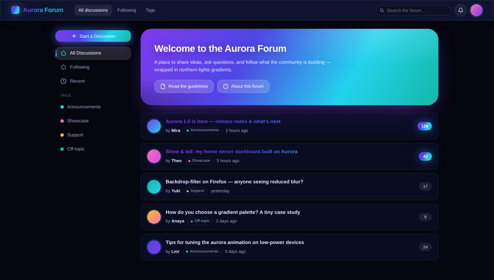
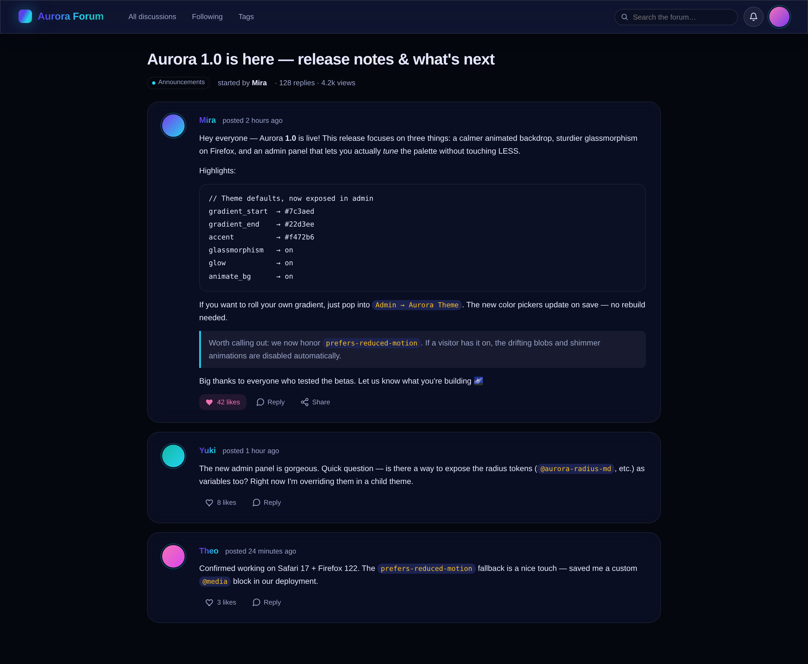
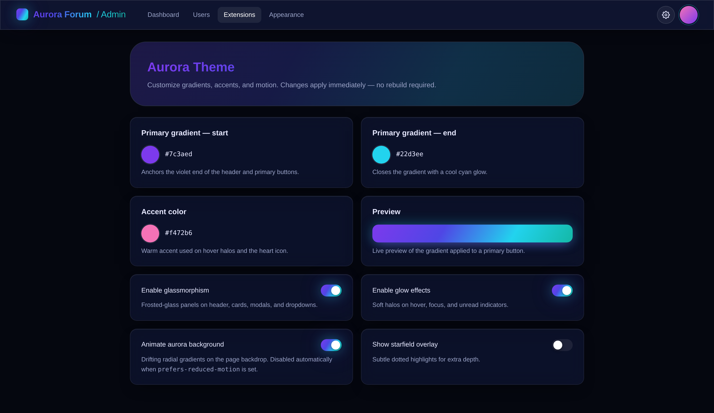

# Aurora Theme for Flarum

[](https://floxum.com/extension/ernestdefoe/aurora)
[](https://floxum.com/extension/ernestdefoe/aurora)
[](https://floxum.com/extension/ernestdefoe/aurora)
[](https://floxum.com/extension/ernestdefoe/aurora)
[](https://floxum.com/extension/ernestdefoe/aurora)

An aurora-inspired theme for [Flarum](https://flarum.org/) featuring animated
gradient backdrops, glassmorphic panels, glowing accents, and a dark night-sky
palette.


> **Flarum 1.x users:** this branch targets Flarum 2.0. For Flarum 1.8.x see the
> [`1.x`](https://github.com/ernestdefoe/aurora/tree/1.x) branch.

## Screenshots

### Forum index

Animated aurora backdrop, glassmorphic discussion cards, gradient text on unread titles,
a glowing pill for unread counts, stat widgets inside the welcome hero, and the
user-facing palette picker popover (shown open).



### Discussion view

Glassy posts with gradient usernames, accent-bordered blockquotes, themed inline code
and code blocks, and gradient-glow avatars.



### Admin settings

Live color swatches, a gradient preview, and toggles for glassmorphism, glow, and
background animation.



## Highlights

- **Animated aurora backdrop** — drifting radial gradients in violet, cyan,
  teal, pink, and magenta on a deep night-sky base.
- **User palette picker** — a circular gradient button in the header opens a
  popover with six presets (Aurora, Sunset, Ocean, Forest, Nebula, Ember).
  Choice persists per-visitor via `localStorage` and applies instantly.
- **Hero widgets** — Members, Discussions, Posts, and Online-now stat tiles
  embedded inside the welcome hero, with live trend lines.
- **Glassmorphic surfaces** — frosted header, sidebar, discussion cards,
  composer, modals, and dropdowns.
- **Gradient buttons & badges** — primary buttons shimmer; unread counts pulse
  with a cool glow.
- **Glowing avatars & focus rings** — soft cyan/pink halos on hover and focus.
- **Gradient scrollbar & text** — gradient-clipped headings, usernames, and
  scrollbar thumb.
- **Configurable** — admin settings for gradient colors, accent color, and
  toggles for glassmorphism, glow, and background animation.
- **Accessible** — honors `prefers-reduced-motion`, visible focus rings.

## Palette presets

| Preset  | Gradient                                                 |
| ------- | -------------------------------------------------------- |
| Aurora  | `#7c3aed` → `#4f46e5` → `#22d3ee` → `#14b8a6` *(default)* |
| Sunset  | `#f97316` → `#f43f5e` → `#d946ef` → `#7c3aed`            |
| Ocean   | `#1e40af` → `#3b82f6` → `#06b6d4` → `#22d3ee`            |
| Forest  | `#15803d` → `#10b981` → `#22d3ee` → `#0ea5e9`            |
| Nebula  | `#a855f7` → `#d946ef` → `#6366f1` → `#3b82f6`            |
| Ember   | `#b91c1c` → `#ea580c` → `#f59e0b` → `#fbbf24`            |

Add or override a preset by extending `PALETTES` in `js/src/forum/palettes.js`.

## Installation

```bash
composer require ernestdefoe/aurora
```

Then enable **Aurora Theme** under **Admin → Extensions**.

## Configuration

Open **Admin → Extensions → Aurora Theme** to customize:

| Setting | Default | Description |
| --- | --- | --- |
| Primary gradient — start | `#7c3aed` | First color of the primary gradient. |
| Primary gradient — end | `#22d3ee` | Last color of the primary gradient. |
| Accent color | `#f472b6` | Warm accent used for hover halos. |
| Enable glassmorphism | `on` | Frosted-glass panels with backdrop blur. |
| Enable glow effects | `on` | Soft glows on hover, focus, and unread items. |
| Animate aurora background | `on` | Drifting gradient blobs in the backdrop. |

## Development

```bash
git clone https://github.com/ernestdefoe/aurora.git
cd aurora/js
npm install
npm run build      # production bundle
npm run dev        # watch mode
```

### Project layout

```
extend.php              Flarum extension bootstrap
composer.json           Package manifest
less/
  forum.less            Forum-facing styles
  admin.less            Admin-facing styles
  variables.less        Color palette, radii, easings
  mixins.less           .aurora-glass, .aurora-text-gradient, ...
  animations.less       drift, shimmer, pulse, float, fade-up
js/
  forum.js, admin.js          Webpack entry points
  src/forum/index.js          Frontend bootstrap: settings, scroll header, ripple
  src/forum/palettes.js       Palette presets + apply/load/store helpers
  src/forum/palette-picker.js Header button + popover injection
  src/forum/hero-widgets.js   Welcome-hero stat tiles
  src/admin/index.js          Admin entrypoint (re-exports extend)
  src/admin/extend.js         Flarum 2 Admin extender — settings registry
  dist/                       Compiled bundles (committed)
resources/locale/
  en.yml                English admin strings
```

## Compatibility

- Flarum core `^2.0.0-beta` (built against `2.0.0-rc.1`)
- PHP `^8.3`
- Modern browsers with `backdrop-filter` support. Older browsers gracefully
  degrade to solid dark surfaces.

Need Flarum 1.x? Switch to the [`1.x`](https://github.com/ernestdefoe/aurora/tree/1.x)
branch — it targets `flarum/core ^1.8.0` and uses the legacy `app.extensionData`
settings API.

## License

[MIT](LICENSE) © Ernest Defoe
